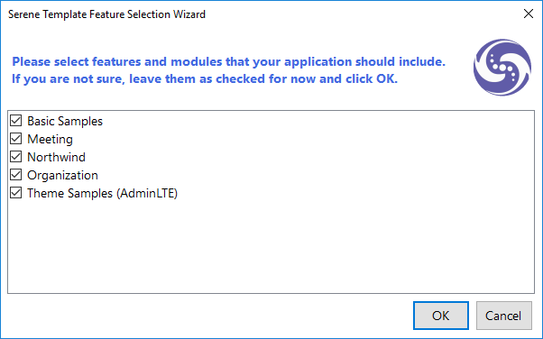

## Removing a Feature Manually

Until recent versions, we only had Northwind, Basic Samples and Theme Samples that should be removed eventually with some help from How-To at:

https://serenity.is/docs/howto/removing_northwind

It involves removing some folders and doing manual changes in a few shared files but still might take some time and is error-prone. 

We also have to keep that guide up to date when something changes.

As we are adding new sample or optional modules like Meeting, Organization and others, the complexity will increase and 
it might become a bit harder to remove a particular feature because of inter-dependencies.

For example, Meeting won't work without Organization and Basic Samples has a dependency to Northwind.

It also increases pressure on us, as we have to answer some questions like "will users really need this module in Serene?", 
"should we make it into a separate tutorial?", "what if user has similar tables in Default database?" etc.

## Feature Selection Wizard

We don't have a solution to auto remove features after application creation (yet) but now you have an option to exclude them by default.

When you are creating a new project, you'll be first asked to select features that you need:



Some features has dependencies to other features, so when you uncheck Northwind for example, Basic Samples will also become unchecked.

It's opposite is also true, e.g. when you check Meeting, Organization module will also be checked.

Any valid combination should work and when template is created, you'll only have folder, files and relevant lines in shared files that belongs to checked features.

## How It Works

We tried to develop this feature as flexible and automatic as possible to not create any extra burden on us while working on Serene.

Our wizard extension in VSIX template makes use of some metadata in **.vstemplate** files.

Here is wizard data in [Serene.vstemplate](https://github.com/volkanceylan/Serene/blob/master/Serene/Serene.vstemplate):

```xml
  <WizardData>
	<features>
	  <feature key="BasicSamples" title="Basic Samples">
		<dependency feature="Northwind" />
	  </feature>
	  <feature key="Meeting" title="Meeting">
		<dependency feature="Organization" />
	  </feature>
	  <feature key="Northwind" title="Northwind">
	  </feature>
	  <feature key="Organization" title="Organization">
	  </feature>
	  <feature key="ThemeSamples" title="Theme Samples (AdminLTE)">
	  </feature>
    </features>
  </WizardData>
```

Here we configure the features and their dependencies. So when we'll want to add another optional feature in Serene, we should first add it here.

Because of historic reasons, our Serene template is a multi-project visual studio template (remember Serene.Script anyone?), so this data resides at 
root template file (Serene.vstemplate).

We have another .vstemplate file for Serene.Web.csproj [Serene.Web.vstemplate](https://github.com/volkanceylan/Serene/blob/master/Serene/Serene.Web/Serene.Web.vstemplate) 
that contains information about which feature contains which files:

```xml
<features>
    <feature key="BasicSamples">
		<files include="Content\site\site.basicsamples.less" />
		<files include="Modules\BasicSamples" />
		<files include="Modules\Common\Imports\ServerTypings\**\BasicSamples.*" />
		<files include="Scripts\site\texts\samples" />
    </feature>
    <feature key="Meeting">
		<files include="Modules\Common\Imports\ServerTypings\**\Meeting.*" />
		<files include="Modules\Common\Migrations\DefaultDB\**\*00_*Meeting*.cs" />
		<files include="Modules\Meeting" />
		<files include="Content\site\site.meeting.less" />
    </feature>
    <feature key="Northwind">
		<files include="Content\site\site.northwind.less" />
		<files include="Modules\Common\Imports\ServerTypings\**\Northwind.*" />
		<files include="Modules\Northwind" />
		<files include="Modules\Common\Migrations\NorthwindDB" />
		<files include="Scripts\site\texts\northwind" />
    </feature>
    <feature key="Organization">
		<files include="Modules\Common\Imports\ServerTypings\**\Organization.*" />
		<files include="Modules\Common\Migrations\DefaultDB\**\*00_*Organization*.cs" />
		<files include="Modules\Organization" />
		<files include="Content\site\site.organization.less" />
    </feature>
    <feature key="ThemeSamples">
		<files include="Modules\AdminLTE" />
    </feature>
</features>
<conditionals>
    <files include="App_Start\SiteInitialization.Migrations.cs" />
    <files include="Content\site\site.less" />
    <files include="Modules\Common\Dashboard\DashboardIndex.cshtml" />
    <files include="Modules\Common\Dashboard\DashboardPage.cs" />
    <files include="Web.config" />
</conditionals>
```

This information is similar to our how-to guide for removing Northwind, but instead, targeted at an automated script.

There are some files, like *site.less* that is shared among modules, e.g.

```
@import "site.theme.less";
@import "site.mixins.less";
@import "site.administration.less";
@import "site.basicsamples.less";
@import "site.membership.less";
@import "site.northwind.less";
```

They are a bit more complex than excluding a directory or file for an automated script.

These files are listed under *conditionals* element.

To mark what line to include/exclude for which module, we marked those files like this:

```less
@import "site.theme.less";
@import "site.mixins.less";
@import "site.administration.less";
//<if:BasicSamples>
@import "site.basicsamples.less";
//</if:BasicSamples>
//<if:Meeting>
@import "site.meeting.less";
//</if:Meeting>
@import "site.membership.less";
//<if:Northwind>
@import "site.northwind.less";
//</if:Northwind>
//<if:Organization>
@import "site.organization.less";
//</if:Organization>
```

This is special markup that is only meaningfull for our VSIX wizard extension. It will use this information to remove specific lines if that module is not checked.

If you are interested to know how it works, you may see source for our VSIX wizard at:

https://github.com/volkanceylan/Serene/tree/master/Template/RootProjectWizard

## What Next?

Thanks to this functionality, we are planning to add more features / modules to Serene in coming months. 

We may allow more granular control like selecting subfeatures, installed NuGet packages etc.

This will also open way to include tutorial code directly in Serene as a module. Thus, we may add MovieTutorial to Serene as a working example. 
If a new user wants to follow Movie Tutorial himself, he may uncheck it at project creation, and train as usual.