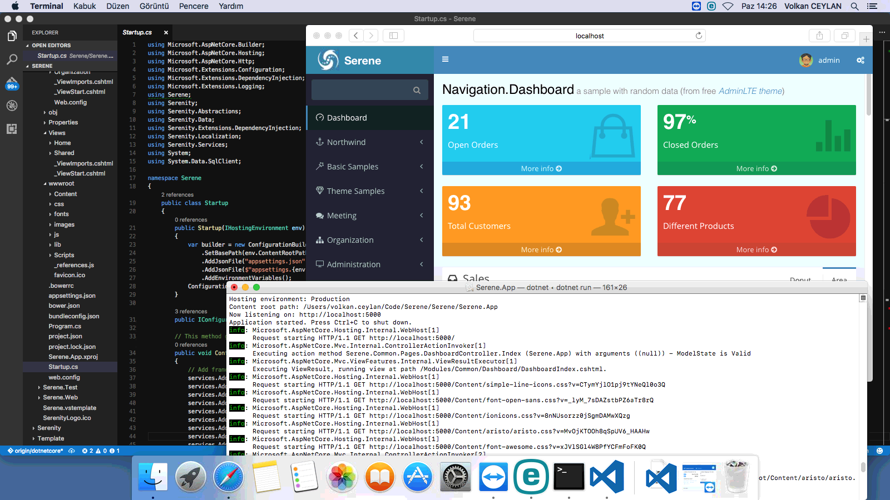

Microsoft is trying really hard to make .NET cross platform, so that it will run on Windows, Linux, Mac and others. 
 
.NET Core (which is something like Mono) is already on version 1.1, which is pretty stable. With its "project.json" based project system,
it promises that all you need to build .NET core applications is a text editor, other than the SDK. 
 
So you may say goodbye to Visual Studio, which only runs on Windows. My favorite editor for coding nowadays is Visual Studio Code. I'm also writing
this blog post on it. It runs pretty fast, stable and cross platform like .NET Core. It's only similarity with Visual Studio is naming, nothing else.

To be honest, .NET platform in general is currently a mess. 

Documentation is very scarce, anything you find is already out of date, or will get out of date tomorrow. 

After acquiring Xamarin, they decided to ditch project.json and turn back to old MsBuild based project system. I hope they'll be able
to get some good parts from project.json, which they are currently working on.

And .NET standard 2.0 is coming. You should read about it in this blog post:

https://blogs.msdn.microsoft.com/dotnet/2016/09/26/introducing-net-standard/

## Current Status on Serenity / Serene

In recent weeks, i've been working on bringing Serenity to .NET Core/Standard platform on a separate branch named **dotnetcore**.

> Actually i tried this a few times at past but gave up mostly due to lack of documentation and buggy tools.

Serenity libraries are currently building on .NET Core / ASP.NET Core:

* Serenity.Core
* Serenity.Data
* Serenity.Data.Entity
* Serenity.Services
* Serenity.Web

Serene.Web, which is the application template, is also ported to ASP.NET Core as Serene.App in **dotnetcore** branch.

Even though it runs and we can see a Serene dashboard page, there are so many things that are missing or partly working:

* Cross platform means you can't use most of .NET libraries available on NuGet.
* FluentMigrator is one of those which is not ported to .NET Core yet, so no migrations. You'll need to use an existing database or create/update manually.
* DynamicScriptManager and DynJS.axd, which allows features like lookup scripts, forms, columns etc. are not yet implemented.
* Authentication middleware is not yet implemented.
* NuGet packages for project.json based projects can't install content files. Script / CSS files that we deploy with Serenity and third-party NuGet packages will have to be moved to an alternative like Bower.
This also means you'll have to update them separately and need NodeJS/NPM.
* There is no VSIX template yet, e.g. something like Serene that you can just *New Project* in Visual Studio. Another alternative is Yeoman.
* You can't port your existing application with a few simple steps to Asp.Net Core. So many things, including namespaces are very different with ASP.NET MVC. 
We'll try to write a migration guide, but it will be a one way trip and won't be so easy.
* We had to use many prepocessor directives like `if #ASPNETCORE` to share some code between platforms, but still it wasn't enough for some cases.
* Dependency injection is baked into platform, so we'll have to use it. This might mean many breaking changes.
* A stable version is several months away in best case.

## Serene Running on a Mac!

Ok, after making it clear that not everything is so shiny, let's give some good news for the new year.

Here is a screenshot that proves Serene is running on a Mac (well with a few quirks):

Well, wish you all a happy new year!