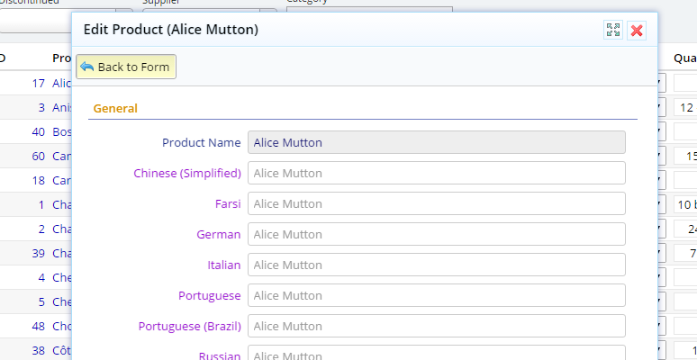
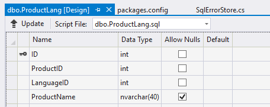

## How It Works in Practice

In case you didn't notice or try *data localization* feature in Serenity, here is how it works in Northwind Products dialog:


When you click the *Localization* button on toolbar, you'll get editing interface for translations:



Here we can localize *Product Name* in a list of languages, which is customizable.

In Product dialog, only the *Product Name* field is set as *localizable*. But, it is possible to set more than
one field as *localizable*.

Localizations are stored in an *data localization extension* table. For *Product* table, corresponding localization
table is *ProductLang* table which has a structure like below:



*ID* is the auto incrementing identity field of this localization table.

Clearly, *ProductID* corresponds to *ProductID* field in *Products* table, e.g. it is foreign key.

*LanguageID* is the language identity from our *Languages* table in default database. We could also use a two letter or 
four letter culture code instead.

*ProductName* is the only localizable field that is matching a field with same name in *Products* table. 
If we wanted to make another field localizable, we should first add it in this table.

## Enabling Data Localization

Before talking about the *simplified* one, let's first see how we used to enable this feature in traditional way:

### Step 1 - Create a Localization Table

First step is to create a data localization table similar to *ProductLang* table, with foreign key, language id, and
fields that you'd like to localize.

The natural choice would be to create it using a migration, but not a necessity. You could also manually create it.

### Step 2 - Generate Code for Localization Table

Using *Sergen* generate code for your data localization row. You'll only need to generate the *Row* class. You won't need
any others like *Repository*, *Endpoint*, *Form*, *Grid* etc.

You'll end up with a row like this:

```cs
public sealed class ProductLangRow : Row, IIdRow, INameRow
{
    public Int32? Id
    {
        get { return Fields.Id[this]; }
        set { Fields.Id[this] = value; }
    }

    [DisplayName("Product Id"), Column("ProductID"), NotNull]
    public Int32? ProductId
    {
        get { return Fields.ProductId[this]; }
        set { Fields.ProductId[this] = value; }
    }

    [DisplayName("Language Id"), Column("LanguageID"), NotNull]
    public Int32? LanguageId
    {
        get { return Fields.LanguageId[this]; }
        set { Fields.LanguageId[this] = value; }
    }

    [DisplayName("Product Name"), Size(40), QuickSearch]
    public String ProductName
    {
        get { return Fields.ProductName[this]; }
        set { Fields.ProductName[this] = value; }
    }
}
```

### Step 3 - Add *ILocalizationRow* Interface to Data Localization Row

Serenity needs to know which field of your row is *Culture ID* or *Language ID*, 
so you'll need to implement *ILocalizationRow* interface:

```cs
public sealed class ProductLangRow : Row, IIdRow, INameRow, ILocalizationRow
{
    public Field CultureIdField
    {
        get { return Fields.LanguageId; }
    }
}
```

### Step 4 - Add *LocalizationRow* Attribute to Main Row

We need to mark our main row, e.g. *ProductRow*, that it is a localizable row, and specify that *ProductLangRow* is its 
localization table.

Need to add *LocalizationRow* attribute to its definition:

```cs
[LocalizationRow(typeof(ProductLangRow))]
public sealed class ProductRow : Row, IIdRow, INameRow
{
}
```

### Step 5 - Add a *RetrieveLocalization* Method to Repository

As we don't have a separate repository for ProductLang table, need a way to read list of localizations 
through *Product* service.

So we add a *RetrieveLocalization* method to our *ProductRepository*:

```cs
public class ProductRepository
{
    public RetrieveLocalizationResponse<MyRow> RetrieveLocalization(
        IDbConnection connection, RetrieveLocalizationRequest request)
    {
        return new LocalizationRowHandler<MyRow>().Retrieve(connection, request);
    }
}
```

Luckily, *LocalizationRowHandler* helper class handles rest of the details for us.

### Step 6 - Add a *RetrieveLocalization* Method to Endpoint

Adding a method to a *repository* doesn't mean that it is accessible as a service from client code. 

So we need to reveal it from *ProductEndpoint.cs*:

```cs
public class ProductController : ServiceEndpoint
{
    public RetrieveLocalizationResponse<MyRow> RetrieveLocalization(
        IDbConnection connection, RetrieveLocalizationRequest request)
    {
        return new MyRepository().RetrieveLocalization(connection, request);
    }
}
```

### Step 7 - Add List of Languages to Product Dialog

To make *Localization* button visible, we need to add a *getLanguages* method to *ProductDialog*:

```ts
namespace Serene.Northwind {

    export class ProductDialog extends Serenity.EntityDialog<ProductRow, any> {

        // ..
        protected getLanguages(): string[][] {
            return LanguageList.getValue();
        }
    }
}
```

This will also determine which languages are available for translation in *localization panel*.

Build your project and you'll be able to see *localization* button in the dialog.

But still, after entering translations and saving the entity, you'll get a JSON deserialization error 
about *Localizations* property (if using a version < 2.8.10).

### Step 8 - Modifying the Save Handler

Our save handler for *ProductRow* looks like this by default:

```cs
private class MySaveHandler : SaveRequestHandler<MyRow>
{
}
```

By default, *SaveHandler* works with a *SaveRequest*. To resolve the JSON deserialization error, and let
localizations to be *saved*, we first need to modify *MySaveHandler* generic signature a bit:

```cs
private class MySaveHandler : SaveRequestHandler<MyRow,
    SaveWithLocalizationRequest<MyRow>, SaveResponse>
{
}
```

This specifies that *MySaveHandler* request type is *SaveWithLocalizationRequest* instead of the base *SaveRequest*
which doesn't (or didn't) include *Localizations* property.

Next we need to handle the save using some help from *LocalizationRowHandler* by overriding *AfterSave* method:

```cs
private class MySaveHandler : SaveRequestHandler<MyRow, 
    SaveWithLocalizationRequest<MyRow>, SaveResponse>
{
    protected override void AfterSave()
    {
        base.AfterSave();

        if (Request.Localizations != null)
            foreach (var pair in Request.Localizations)
            {
                pair.Value.ProductID = Row.ProductID.Value;
                new LocalizationRowHandler<MyRow>().Update<Entities.ProductLangRow>(
                    this.UnitOfWork, pair.Value, Convert.ToInt32(pair.Key));
            }
    }
}
```

After the main entity (*Product*) is saved, this will make sure that *Localizations* are also saved into *ProductLang* table.

### Step 9 - Modifying *Create* and *Update* Repository Methods

As our save handler's request type is changed, need to modify signatures of *Create* and *Update* methods accordingly:

```cs
public SaveResponse Create(IUnitOfWork uow, SaveWithLocalizationRequest<MyRow> request)
{
    return new MySaveHandler().Process(uow, request, SaveRequestType.Create);
}

public SaveResponse Update(IUnitOfWork uow, SaveWithLocalizationRequest<MyRow> request)
{
    return new MySaveHandler().Process(uow, request, SaveRequestType.Update);
}
```

We changed *SaveRequest* to *SaveWithLocalizationRequest* in these methods.

### Step 10 - Modifying *Create* and *Update* Endpoint Methods

As these methods are *serviced* from our Endpoint.cs, need to do similar modification in that file too:

```cs
public class ProductController : ServiceEndpoint
{
    [HttpPost, AuthorizeCreate(typeof(MyRow))]
    public SaveResponse Create(IUnitOfWork uow, SaveWithLocalizationRequest<MyRow> request)
    {
        return new MyRepository().Create(uow, request);
    }

    [HttpPost, AuthorizeUpdate(typeof(MyRow))]
    public SaveResponse Update(IUnitOfWork uow, SaveWithLocalizationRequest<MyRow> request)
    {
        return new MyRepository().Update(uow, request);
    }

    //...
}
```

### Step 11 - Take a Deep Breath

If you were able to follow steps so far, without making some mistakes along the way, your data localization 
should be working properly.

Even if it's a matter of copy paste, and we made use of some helpers like *LocalizationRowHandler*, 
it is still too much. 

More manual steps means more mistakes, and even if you are lucky, you'll end up with more code to maintain.

I probably don't need to repeat that i prefer declarative code *where possible* or *where i could design it*.
I was thinking for some time about how to simplify this and make it declarative, so here is what i came up with...

## Simplified Declarative Way Using a Service Behavior

Starting with *2.8.10* we have a *LocalizationBehavior* that activates automatically for all rows that has a
*LocalizationRow* attribute.

That means everything after *Step 4* becomes unnecessary. 

If you did any of the changes in those steps, you can just delete/revert them.

> It will still work if you leave them as is, but you'll be double saving localizations in worst case.

If you have an existing application, you'll need to do a little change in *ScriptInitialization.cs*:

```cs
Serenity.EntityDialog.defaultLanguageList = LanguageList.getValue;
```

Add this line at the bottom of others. This will remove the need for *getLanguages* in Dialog.ts files, e.g. Step 7.


