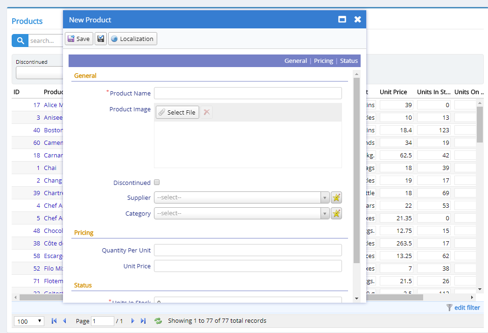
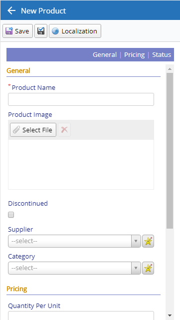
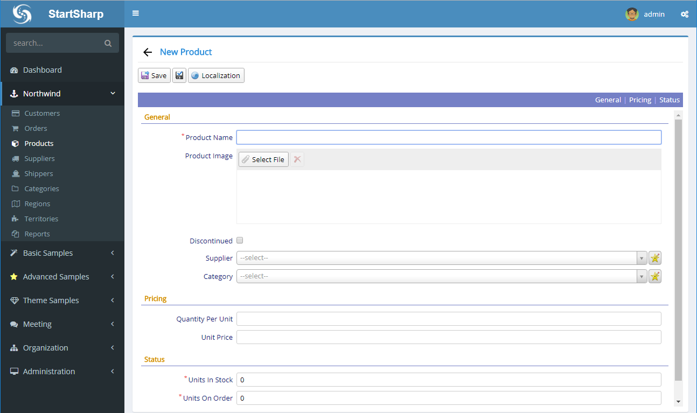

## Classic Dialog UI

Here is our classic product dialog from Northwind module:



It is draggable and maximizable, like desktop windows. Some of our users praise how familiar it looks and works for end users, which we generally agree.

It uses jQuery UI dialog widget under the hood, but you may not see any jQuery UI specific code by looking at *ProductDialog* source:

```ts
namespace StartSharp.Northwind {

    @Serenity.Decorators.registerClass()
    @Serenity.Decorators.maximizable()
    export class ProductDialog extends Serenity.EntityDialog<ProductRow, any> {
        protected getFormKey() { return ProductForm.formKey; }
        protected getIdProperty() { return ProductRow.idProperty; }
        protected getLocalTextPrefix() { return ProductRow.localTextPrefix; }
        protected getNameProperty() { return ProductRow.nameProperty; }
        protected getService() { return ProductService.baseUrl; }

        protected form = new ProductForm(this.idPrefix);
    }
}
```

These details are handled by our *EntityDialog* base class which is in turn a subclass of *TemplatedDialog* that actually creates a jQuery UI dialog. 

*@Serenity.Decorators.maximizable()* on top of our class makes it a maximizable dialog. This is the only dialog specific code we have here actually.

It's possible to customize some dialog parameters by overriding *getDialogOptions* method but for now let's keep focus on the panel system.

## Responsive Dialogs

When you open same page and dialog in a mobile device (or resize browser window), UI changes into a mobile friendly layout:



This is fully automatic and is again handled by *TemplatedDialog* base class.

The product form you see is still based on jQuery UI dialog, but as jQuery UI itself is not so mobile-friendly, we use some CSS and tricks to make it look like a full page responsive layout.

## The Panel Decorator

What if you wanted to have a full page UI, even in desktop devices? Well, you could auto maximize the dialog on open but this wouldn't be ideal as it would also hide navigation.

Serenity 3.1+ turns dialog classes with *@Serenity.Decorators.panel()* decorator into full page panels.

> The decorator isn't new, but automatic behavior is.

Let's add the decorator to *ProductDialog* class:

```ts
namespace StartSharp.Northwind {

    @Serenity.Decorators.registerClass()
    @Serenity.Decorators.maximizable()
    @Serenity.Decorators.panel()
    export class ProductDialog extends Serenity.EntityDialog<ProductRow, any> {
        protected getFormKey() { return ProductForm.formKey; }
        protected getIdProperty() { return ProductRow.idProperty; }
        protected getLocalTextPrefix() { return ProductRow.localTextPrefix; }
        protected getNameProperty() { return ProductRow.nameProperty; }
        protected getService() { return ProductService.baseUrl; }

        protected form = new ProductForm(this.idPrefix);
    }
}
```

We only added `@Serenity.Decorators.panel()` line and here is the result:



> We could actually remove *maximizable* decorator now as it is not used in panel mode. But, it is possible to explicitly open a panel in dialog mode when required, so maximizable might still be useful in that case.

Now we don't have a *Close* button but a *Back* button instead. As panel is already full page, *maximize* button is not shown in this mode.

One thing we should also note is, unlike responsive dialog sample before, where we still had a jQuery UI dialog and styled it, no jQuery UI dialog is created in this mode.

## Opening a Panel in Dialog Mode (or vice-versa, Dialog in Panel Mode)

@Serenity.Decorators.panel() only controls the default mode UI should operate in.

It is possible to open a dialog with *panel* attribute in *dialog* mode (or vice-versa) when required:

You may type these in a browser console, or write them on a button click event (replace StartSharp with your namespace):

```ts
// force widget to open in dialog mode
var dlg1 = new StartSharp.Northwind.ProductDialog();
dlg1.loadNewAndOpenDialog(false);

// force widget to open in panel mode
var dlg2 = new StartSharp.Northwind.ProductDialog();
dlg2.loadNewAndOpenDialog(true);

// auto decide open mode, e.g. if class has a panel 
// decorator open in panel mode widget to open in panel mode,
// otherwise open in dialog mode. this is the default.
var dlg3 = new StartSharp.Northwind.ProductDialog();
dlg3.loadNewAndOpenDialog();
```

When *loadNewAndOpenDialog* is called with no parameters, it checks if class has a *panel* decorator. If it has, it opens in panel mode, otherwise in dialog mode.

If you pass *false* to *loadNewAndOpenDialog* it forces to open widget in dialog mode, even if it has a *panel* decorator.

If you pass *true* to *loadNewAndOpenDialog* it forces to open widget in panel mode, even if it doesn't have a *panel* decorator.

There are other similar methods like *dialogOpen()* and *loadEntityAndOpenDialog()* that accepts this *asPanel* boolean flag and operates similarly.

## Overriding Dialog/Panel Mode for a Specific Grid

There may be cases when a dialog class has *panel* attribute, but for a specific grid, you may want its dialogs that is shown when you click *Add* button or click an *edit link* to open in dialog mode, or the opposite.

Grids now has *openDialogsAsPanel* property which is *null*, e.g. *auto* by default, but it is possible to set it to *false* to force dialogs launched from this grid open in *dialog mode*, or *true* to open in *panel mode*.

```ts
export class ProductGrid extends Serenity.EntityGrid<ProductRow, any> {
    //...
    constructor(container: JQuery) {
        super(container);

        // force new and edit item dialogs to open in panel mode
        this.openDialogsAsPanel = true;
    }
```

This property is also settable from outside the grid class (e.g. public property), so you might force a grid class to open its dialogs in panel mode in some page, while dialog mode in another.

## Conclusion

Turning your classic dialog into a mobile friendly, full page panel is a nice addition to Serenity, and the best part is it is just a one liner. 

We recommend this mode as default for dialogs with large forms. 

As a bonus, panel mode is more compatible with bootstrap grid layout, which we'll talk in a future post.