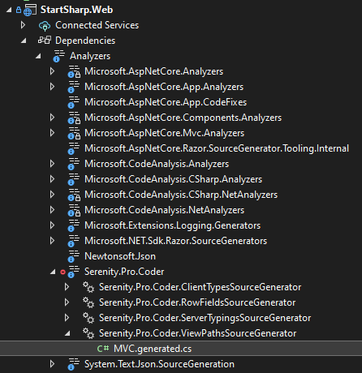

## Introduction

Source Generators that ship as part of the .NET Compiler Platform ("Roslyn") SDK (since .NET 5) let C# developers inspect user code as it is being compiled. The generator can create new C# source files on the fly that are added to the user's compilation. In this way, you have code that runs during compilation. It inspects your program to produce additional source files that are compiled together with the rest of your code.

> https://learn.microsoft.com/en-us/dotnet/csharp/roslyn-sdk/source-generators-overview

We are now making use of this feature via our `Serenity.Pro.Coder` NuGet package. 

> It is currently a premium feature only available for StartSharp customers.

## Our Set of Source Generators

We initially have 4 source generators:

- View Paths
- Client Types
- Server Types
- Row Fields

First three can be considered similar to our `dotnet sergen` tool's `mvc`, `clienttypes` and `servertypings` commands, but unlike `sergen` these source generators produce code while you are editing code in Visual Studio, not just on build.

## Enabling Source Generators

Source generators comes pre-enabled with StartSharp projects after version 6.1.x. If you have an older project, you may use `stargen` to enable source generators for your project or follow the steps outlined below.

But before starting, please take a backup of your project, and commit / stash your changes.

Start by updating Serenity packages as usual then include the latest version of `Serenity.Pro.Coder` package reference in `YourProject.Web.csproj`

```xml
<ItemGroup>
    <!--...-->
    <PackageReference Include="Serenity.Pro.Coder" Version="6.1.9" />
</ItemGroup>
```

Once you include Serenity.Pro.Coder reference, source generators will be enabled and some files generated by `sergen` under `Imports` directory like `MVC/MVC.cs` and `ClientTypes\*.cs` and will be excluded from your project as they would otherwise conflict with the code generated by Serenity.Pro.Coder.

> You may later delete those legacy files if you are happy with the source generator.

Disable classic sergen transforms on build by adding a condition to `TransformMvcClientTypes` and `TransformServerTypings` steps so that they won't unnecessarily run on build:

```xml
  <Target Name="TransformMvcClientTypes" BeforeTargets="BeforeBuild" 
    Condition="'$(SourceGeneratorTransform)' == 'false'" >
    <!---->
  </Target>
  <Target Name="TransformServerTypings" AfterTargets="AfterBuild"
    Condition="'$(SourceGeneratorTransform)' == 'false'">
  </Target>
```

This way you can later re-enable classic sergen transforms by setting a property named `SourceGeneratorTransform` to false.

## View Paths Source Generator

This one generates paths to your razor views (.cshtml) just like `dotnet sergen mvc` command.

It generates an in memory code file similar to the `Imports/MVC/MVC.cs` but not as a physical file.

You can inspect the generated file under `Solution Explorer` -> `YourProject.Web` -> `Dependencies` -> `Analyzers` -> `Serenity.Pro.Coder` -> `Serenity.Pro.Coder.ViewPathsSourceGenerator` -> `MVC.generated.cs`



```cs
namespace StartSharp
{
    public static class MVC
    {
        public static class Views
        {
            public static class Common
            {
                public static class Dashboard
                {
                    public const string DashboardIndex = "~/Modules/Common/Dashboard/DashboardIndex.cshtml";
                }
            }

            public static class Errors
            {
                public const string AccessDenied = "~/Views/Errors/AccessDenied.cshtml";
                public const string ValidationError = "~/Views/Errors/ValidationError.cshtml";
            }
//...
```

Once you add a new CSHTML file to your project, or rename an existing one, this file's content will be instantly changed so that you can reference a view's location with intellisense support.

You don't have to run `dotnet sergen mvc` or build the project (as that command normally runs automatically on build)

## Client Types Source Generator

Just like `dotnet sergen clienttypes` command, this source generator creates attribute classes corresponding to editor types you define in your TypeScript sources, so that you can reference them in your forms.

You can inspect generated files under `Solution Explorer` -> `YourProject.Web` -> `Dependencies` -> `Analyzers` -> `Serenity.Pro.Coder` -> `Serenity.Pro.Coder.ClientTypesSourceGenerator`

Normally incremental .NET source generators are not designed for files other than C#. It is possible to watch other file types via a option called `AdditionalFiles`. But unfortunately, once we do that for `.ts` files, `TypeScript` intellisense in Visual Studio is lost for them (probably a bug). 

We applied some workarounds to overcome this problem, but sometimes it may take some time for the sources to be updated if you add / remove / change some editor type in TypeScript. In worst case, you might need a rebuild (or restart VS).

## Server Typings Source Generator

As should be obvious by now, this one works similar to `dotnet sergen servertypings` command. 

Unlike other two source generators, this one generates the files directly on the disk under `Imports/ServerTypings/` or `Modules/ServerTypes` folders depending on your usage of modular Typescript (same with latest sergen).

The reason for this is following. A source generator is not allowed to produce code other than C#. Even if it could (in a future version of .NET maybe), the TypeScript compiler would not be able to read in memory TypeScript files (as it would expect them to be in the file system).

Thus, you can't find anything under `Analyzers' for this source generator. All the generated files are on the disk.

There is only one difference with `sergen`. Again, you don't have to run the command manually, or build the project. Once you change a .NET class like a form, row, column, enum etc., the corresponding files are magically generated for you, just in time.

## Row Fields Generator

This one is very different from others, as it has no equivalent in `sergen`. 

To understand what it does, lets take the `LanguageRow` as a sample:

```cs
using Serenity.ComponentModel;
using Serenity.Data;
using Serenity.Data.Mapping;
using System;
using System.ComponentModel;

namespace StartSharp.Administration
{
    [ConnectionKey("Default"), Module("Administration"), TableName("Languages")]
    [DisplayName("Languages"), InstanceName("Language")]
    [ReadPermission(PermissionKeys.Translation)]
    [ModifyPermission(PermissionKeys.Translation)]
    [LookupScript(typeof(Lookups.LanguageLookup))]
    public sealed class LanguageRow : Row<LanguageRow.RowFields>, IIdRow, INameRow
    {
        [DisplayName("Id"), Identity, IdProperty]
        public Int32? Id
        {
            get => fields.Id[this];
            set => fields.Id[this] = value;
        }

        [DisplayName("Language Id"), Size(10), NotNull, QuickSearch]
        public String LanguageId
        {
            get => fields.LanguageId[this];
            set => fields.LanguageId[this] = value;
        }

        [DisplayName("Language Name"), Size(50), NotNull, QuickSearch, NameProperty]
        public String LanguageName
        {
            get => fields.LanguageName[this];
            set => fields.LanguageName[this] = value;
        }

        public LanguageRow()
        {
        }

        public LanguageRow(RowFields fields)
            : base(fields)
        {
        }

        public class RowFields : RowFieldsBase
        {
            public Int32Field Id;
            public StringField LanguageId;
            public StringField LanguageName;
        }
    }
}
```

As you see, it is pretty long, even though it has three properties, `Id`, `LanguageId`, and `LanguageName`. This is partly required for `Serenity Entity` system to work. We have `get/set` accessors and a special `RowFields` class. 

Even though it can be generated by `sergen`, it can be a tedious task to add new properties, as you would have to do changes in at least two places and doing typos in getter / setter is possible during copy/paste.

Let's rewrite this (as Language2Row) by making use of our Row source generator:

> WARNING! This source generator should be considered much more riskier than others. Once you start using it, you can't simply disable source generator and go back to using classic `sergen` method. You would need to revert all your modified row classes as they would not work without the source generator.

> We don't recommend using it at this stage, and it is possible that it may change in the future versions. We're waiting for the partial property feature (or a similar one) to be available in C# to get rid of the `RowTemplate` class you'll see in the following sample.

```cs
using Serenity.ComponentModel;
using Serenity.Data;
using Serenity.Data.Mapping;
using System;
using System.ComponentModel;

namespace StartSharp.Administration
{
    [ConnectionKey("Default"), Module("Administration"), TableName("Languages")]
    [DisplayName("Languages"), InstanceName("Language")]
    [ReadPermission(PermissionKeys.Translation)]
    [ModifyPermission(PermissionKeys.Translation)]
    [LookupScript(typeof(Lookups.LanguageLookup))]
    public sealed partial class LanguageRow
    {
        private class RowTemplate
        {
            [DisplayName("Id"), Identity, IdProperty]
            public Int32? Id { get; set; }
            [DisplayName("Language Id"), Size(10), NotNull, QuickSearch]
            public String LanguageId { get; set; }
            [DisplayName("Language Name"), Size(50), NotNull, QuickSearch, NameProperty]
            public String LanguageName { get; set; }
        }
    }
}
```

Nice, it became much shorter now. So what did we do?

- Added a partial modifier - _(this is mandatory)_
- Removed the base class (`Row<LanguageRow.RowFields>`) - _(optional, you could keep it)_
- Removed `IIdRow`, `INameRow` - _(optional, you could keep them)_
- Defined a nested `RowTemplate` class - _(it must be named exactly as `RowTemplate`)_
- Moved all properties to the RowTemplate class - _(it is possible to leave some of the properties in the row class in case the generated properties does not work like you expected)_
- Got rid of the get / set accessors - _(you must for the ones moved to the RowTemplate)_
- Removed the Row constructor - _(optional, you may keep it if has custom arguments etc.)_
- Removed the `RowFields` class and the fields - _(optional, you may keep it for dependency injection etc. but it must be partial)_

Yes, it really does act just like our original LanuageRow class. You may run the project and check that it works properly. So where is our property definitions and other boilerplate code?

Open `Solution Explorer` -> `YourProject.Web` -> `Dependencies` -> `Analyzers` -> `Serenity.Pro.Coder` -> `Serenity.Pro.Coder.RowFieldsSourceGenerator` -> `YourProject.Administration.LanguageRow.generated.cs`:

```cs
using Serenity.Data;
using Serenity.Data.Mapping;
using System.ComponentModel;

namespace StartSharp.Administration
{
    partial class LanguageRow : Row<LanguageRow.RowFields>, IIdRow, INameRow
    {
        private int? id;
        private string languageId;
        private string languageName;

        [DisplayName("Id"), Identity, IdProperty]
        public int? Id
        {
            get => fields.Id[this];
            set => fields.Id[this] = value;
        }

        [DisplayName("Language Id"), Size(10), NotNull, QuickSearch]
        public string LanguageId
        {
            get => fields.LanguageId[this];
            set => fields.LanguageId[this] = value;
        }

        [DisplayName("Language Name"), Size(50), NotNull, QuickSearch, NameProperty]
        public string LanguageName
        {
            get => fields.LanguageName[this];
            set => fields.LanguageName[this] = value;
        }

        public partial class RowFields : RowFieldsBase
        {
            public Int32Field Id;
            public StringField LanguageId;
            public StringField LanguageName;

            protected override void CreateGeneratedFields()
            {
                Id = new Int32Field(this, "Id", null, 0, FieldFlags.Default,
                    getValue: row => ((LanguageRow)row).id,
                    setValue: (row, value) => ((LanguageRow)row).id = value);

                LanguageId = new StringField(this, "LanguageId", null, 10, FieldFlags.Default,
                    getValue: row => ((LanguageRow)row).languageId,
                    setValue: (row, value) => ((LanguageRow)row).languageId = value);

                LanguageName = new StringField(this, "LanguageName", null, 50, FieldFlags.Default,
                    getValue: row => ((LanguageRow)row).languageName,
                    setValue: (row, value) => ((LanguageRow)row).languageName = value);
            }
        }
    }
}
```

OK, here we have the base class and `IIdRow`, `INameRow` interfaces. A property is generated for every property we defined in the `RowTemplate` class.

You may notice that it is a bit different than our original `LanguageRow` style. There are `private members` in the Row class now, and we have a new `CreateGeneratedFields` method.

If you don't define private class members (also called fields in .NET) corresponding to the properties, `Serenity Entities` internally uses an array for field storage. Reading / writing from an array is a bit slower than using private fields.

If there are private fields, but no `getValue`, `setValue` delegates, e.g. if you are not creating the Int32Field, StringField objects by passing those delegates, Serenity creates them via IL code generation, which slows down the first initialization.

In the past, we used to write the code for `Row` classes just like the style shown above, but it was even more tedious and error prone so we switched to the style shown in the original `LanguageRow` and let `Serenity` create the field objects itself.

But it is not a trouble at all for the source generator itself. So we use this style which runs and initializes faster than the array based default one.

Again, we would like to note that this source generator might change in future versions of Serenity. We originally wanted to be able to define our properties without having to create a `RowTemplate` class, but unfortunately C# does not support partial getters / setters. 

Also if something goes wrong with the source generator, it won't be easy to go back to classic Row style. When you disable the source generator, you'll lose all the generated Row Fields classes etc. so your rows will be broken.

See following section, if you still want to use row fields source generator and have an emergency fallback.

## Saving Generated Files to Disk

It is possible to save the generated files to disk, and you may check them into source control just in case something goes wrong. Make sure you save them to a location ignored by the project, or you'll have duplicate classes while source generator is active:

```xml
<PropertyGroup>
    <EmitCompilerGeneratedFiles>true</EmitCompilerGeneratedFiles>
    <CompilerGeneratedFilesOutputPath>Generated</CompilerGeneratedFilesOutputPath>
</PropertyGroup>

<ItemGroup>
    <Compile Remove="$(CompilerGeneratedFilesOutputPath)\**\*.cs" />
</ItemGroup>
```

Above we save them under Generated folder and remove them from the compilation. Please note that this will potentially save the files only on build.