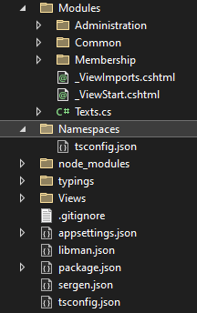
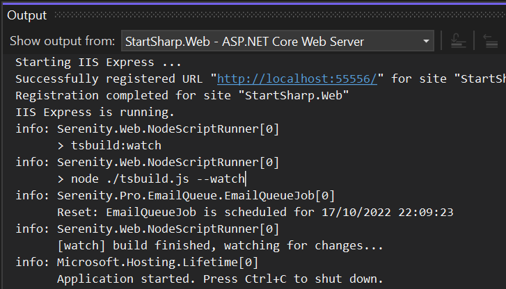

## Introduction

We originally used `namespace` style TypeScript (https://www.typescriptlang.org/docs/handbook/namespaces.html), as that was the preferred way back then (about 9 years ago) and was named `internal modules`.

```ts
// MyFolder/MyDialog.ts
namespace MyProject {
    export class MyDialog extends Serenity.EntityDialog {
    // ...
```

```ts
// AnotherFolder/Utils.ts
namespace MyProject {
    export function createAndOpenMyDialog() {
        var dlg = new MyProject.MyDialog({ ... });
        dlg.dialogOpen();
        //...
```

Even TypeScript source itself is still using namespaces (https://github.com/microsoft/TypeScript/blob/13c9b05384544262363f3fd8b942b36aeb84fc61/src/compiler/core.ts). They are also trying to convert the code to ES modules.

Before switching to TypeScript we were using Script# (https://github.com/nikhilk/scriptsharp) followed by Saltaralle (https://github.com/Saltarelle) that are both C# to Javascript compilers. Script# stopped being updated 9 years ago, and Saltarelle is acquired by Bridge.NET, another C# to Javascript compiler in 2015 and become unmaintained. 

As we code in C# using these compilers, we were using namespaces and while switching to TypeScript, using namespaces made converting code and interoperatability with legacy code easier. We even had to use Saltaralle's corelib script (mscorlib.js) for a long time as we had some applications where we used TypeScript and Saltaralle code together.

As most of our users are C# developers, namespaces felt more natural to us, and `mapping between C# / TypeScript` classes via `Sergen` were simpler.

Another reason for namespaces was using a single output file (`YourProject.Web.js`) with TypeScript compile on save support in Visual Studio, and not having to use a separate javascript build tool. We deliberately skipped options like WebPack etc. in the past as they were a bit complex for our purposes and slowed the build / development process.

Unfortunately, namespaces are starting to feel like they are second class citizens in both TypeScript / Javascript world in general. 

Most samples and libraries you may find in internet these days are written using EcmaScript modules (https://www.typescriptlang.org/docs/handbook/modules.html) and delivered as NPM packages.

TypeScript also recommends using modules: https://www.typescriptlang.org/docs/handbook/namespaces-and-modules.html

There are many module formats that was developed before ES Modules became a standard, including `AMD`, `UMD`, `CommonJS` and similar. But we're skipping all of them and using the web standard EcmaScript Modules.

- https://developer.mozilla.org/en-US/docs/Web/JavaScript/Guide/Modules

The above sample could be written with EcmaScript modules as follows:

```ts
// MyFolder/MyDialog.ts
import { EntityDialog } from "@serenity-is/corelib";

export class MyDialog extends EntityDialog {
// ...
```

```ts
// AnotherFolder/Utils.ts
import { MyDialog } from "../MyFolder/MyDialog";

export function createAndOpenMyDialog() {
    var dlg = new MyDialog({ ... });
    dlg.dialogOpen();
    //...
```

You may notice above that there are no longer `Serenity` and `MyProject` namespaces and there are extra `import` statements on top of the files instead.

A disadvantage of namespaces is revealed when you want to have different isolated parts in your web application, like frontend / backend, while sharing some code selectively between them. As the dependencies of a class can't be determined as easily as isolated EcmaScript modules, it is not easy to do that with namespaces.

In the namespaces sample, the dialog class referenced the `Serenity` namespace from the global context (e.g. window), which is actually loaded into the global context by executing `Serenity.CoreLib.js` file. But from the source code itself it is not possible to know for sure where this `Serenity.EntityDialog` class originates from. It could be simply defined in another `.ts` file in your project itself.

> In javascript it is possible to override almost everything, so EntityDialog could be a class in your project even if it is under Serenity namespace.

In the ES modules sample, the import from `@serenity-is/corelib` module for `EntityDialog` is clearly specified. So build tools like ESBuild (which we'll be using) can know where a class originates from, and when and how they can use `tree shaking`, `code splitting` etc. features if desired:

https://esbuild.github.io/api/#tree-shaking

https://esbuild.github.io/api/#splitting


## What This will Mean for Your Existing Code

We take backward compatibility seriously as we value our users existing investments on Serenity, and have a long time track of making major switches as painless as possible.

Thus, that applies to ES modules migration as well. Your existing code written using namespaces will continue to work (simply by moving `.ts` into a special `Namespaces` root folder). 

Once ES modules are enabled in your project, `sergen` will start generating code in module style (not to be confused with `Modules` folder, but ES modules code will be there) but existing pages written with `Namespace` style will continue to work.

ES Modules are currently enabled by default only for `StartSharp` as we want to test this initial migration with a limited audience first, then enable it for `Serene` after our tutorials for newcomers are updated to use `modules`.

Serene users can still switch now to ES modules if they want to try that. Everything we'll explain here is available in base `Serenity` framework that is shared by Serene and StartSharp.

## Enabling TypeScript ES Modules

If you create a new project with `StartSharp` 6.2+, modules will be enabled by default and there will be no `namespace` style legacy code in your project.

If you use `stargen` to migrate your code, it will automatically migrate your project to use ES modules, and move your existing `namespace` style TypeScript files to `Namespaces` folder.

StartSharp customers who want to manually enable ES modules in their project should follow steps in migration guide below (Serene users can't for now, as the document has links to StartSharp repository for some files like tsbuild.js).

- https://serenity.is/docs/migration/v6-0-0-to-v6-1-6

If you are a Serene user who wants to try ES modules now, follow the steps outlined below:

> StartSharp users can also follow below ones as they has a few differences from the migration guide, especially in `tsbuild.js` part.

### Update Serenity Packages to Latest (at least 6.2.6)

First, update all Serenity packages and Sergen tool to at least 6.2.6 in your CSPROJ file (https://serenity.is/docs/migration/README)

```xml
  <ItemGroup>
    <PackageReference Include="Serenity.Assets" Version="6.2.6" />
    <PackageReference Include="Serenity.Scripts" Version="6.2.6" />
    <PackageReference Include="Serenity.Net.Web" Version="6.2.6" />
    <PackageReference Include="Serenity.Extensions" Version="6.2.6" />
    <PackageReference Include="Serenity.Demo.Northwind" Version="6.2.6" />
    <PackageReference Include="Serenity.Demo.BasicSamples" Version="6.2.6" />
  </ItemGroup>
```

Make sure you also update `sergen` tool by running:

```cmd
dotnet tool update sergen
```

## Create a Namespaces Folder and `Namespaces/tsconfig.json` File

Create a folder named `Namespaces` next to `Modules` folder. This will contain our old namespace style TypeScript files, and our `MyProject.Web.js` will only be built from files in this folder.

Copy and paste your `tsconfig.json` at root to that folder.



Modify following lines in `Namespaces/tsconfig.json` (which will be for namespaces) as shown in the diff view (e.g. add composite: true, remove inlineSourceMap etc.):

```diff
   "compilerOptions": {
+    "composite": true,
-    "inlineSourceMap": true,
+    "noEmitOnError": false,
+    "sourceMap": true,
+    "forceConsistentCasingInFileNames": true,
-    "outFile": "wwwroot/Scripts/site/MyProject.Web.js",
+    "outFile": "../wwwroot/Scripts/site/MyProject.Web.js",
+    "rootDir": "../",
-    "target": "ES5",
+    "target": "ES6",
     "typeRoots": [
-      "./node_modules/@types/",
-      "./typings/"
+      "../node_modules/@types",
+      "../typings/"
     ]
   },
   "include": [
-    "./Imports/**/*",
-    "./Modules/**/*"
+    "../Imports/**/*",
+    "./**/*"
```

Some of these changes are not critical. 

For example `forceConsistentCasingInFileNames` is an option we are adding so that if you happen to build your project in a case sensitive file system like Linux ones, you'll not get build errors due to referenced paths not matching exactly in file name casing.

Most important ones are `typeRoots`, `include` and `outFile` as our `tsconfig.json` location has changed.

## Move All Existing TypeScript Files Under `Modules` to `Namespaces`

Open a command line in the project root and run following two commands:

```
C:\..\MyProject.Web> robocopy Modules\ Namespaces\ *.ts *.tsx /MOV /S
```

This should move all .ts and .tsx files under Modules to Namespaces.

## Modify Root `tsconfig.json` File for ES Modules

The root `tsconfig.json` file will be used for new ES module style TypeScript files under `Modules` folder. 

Modify following lines in `tsconfig.json` at project root (which will be for modules):

```diff
   "compilerOptions": {
-    "declaration": true,
+    "allowJs": false,
+    "baseUrl": ".",
+    "declaration": false,
+    "esModuleInterop": true,
+    "forceConsistentCasingInFileNames": true,
+    "isolatedModules": true,
-    "noEmitHelpers": true,
+    "noEmitHelpers": false,
-    "inlineSourceMap": true,
-    "inlineSources": true,
+    "sourceMap": false,
-    "outFile": "wwwroot/Scripts/site/MyProject.Web.js",
+    "module": "ESNext",
+    "moduleResolution": "Node",
+    "noEmit": true,
+    "noEmitOnError": false,
+    "outDir": "./wwwroot/esm",
+    "paths": {
+      "@/*": [ "Modules/*" ],
+      "@serenity-is/*": [ "node_modules/@serenity-is/*/dist/index" ]
+    },
+    "rootDir": ".",
-    "target": "ES5",
+    "target": "ES6",
     "typeRoots": [
-      "./node_modules/@types/",
-      "./typings/"
+      "./node_modules/@types"
+    ],
+    "types": [
+      "jquery",
+      "jquery.validation",
+      "jqueryui",
+      "toastr"
     ]
   },
   "include": [
-    "./Imports/**/*",
     "./Modules/**/*"
-  ]
+  ],
+  "typeAcquisition": {
+    "enable": false
+  }
 }
```

## Create a `tsconfig.json` File Under `Imports` Folder

Create a `Imports/tsconfig.json` file with following content:

```json
{
  "extends": "../Namespaces/tsconfig.json",
  "compileOnSave": false,
  "compilerOptions": {
    "noEmit": true,
    "emitDeclarationOnly": false,
    "rootDir": "../"
  }
}
```

> This makes sure that the TypeScript code under `Imports` does not use the modular `tsconfig.json`


## Add a `tsbuild.js` File to the Root

This will be our entry point to calling `esbuild` tool via `@serenity-is/tsbuild` package. We named our package `tsbuild` as we'll use it for building our modules type TypeScript files.

```js
import { checkIfTrigger, build } from "@serenity-is/tsbuild";

checkIfTrigger();

await build({
});
```

This imports and uses our `build` and `checkIfTrigger` functions from `@serenity-is/tsbuild` library, which in turn calls `esbuild.build` method.

It is possible to overwrite options passed to esbuild here but the defaults should be enough for now.

> See https://github.com/serenity-is/Serenity/blob/master/src/Serenity.Scripts/tsbuild/dist/index.js for `tsbuild` source and default options

## Modify `package.json` to Install `tsbuild` Package

Make following changes to the `package.json`. Don't remove `vue`, `@types/sortablejs` etc. if you are using them anywhere.

```diff
{
   "dependencies": {
+    "@serenity-is/corelib": "6.2.5",
-    "@types/jquery": "^2.0.39",
+    "@types/jquery": "2.0.48",
-    "@types/jqueryui": "^1.11.32",
+    "@types/jqueryui": "1.12.6",
-    "@types/jquery.validation": "^1.13.32",
+    "@types/jquery.validation": "1.16.7",
-    "@types/toastr": "^2.1.33",
+    "@types/toastr": "2.1.39"
-    "@types/jquery.blockui": "0.0.27",
-    "@types/jquery.cookie": "^1.4.28",
-    "@types/sortablejs": "^1.3.31",
-    "vue": "^2.5.2"
   },
   "devDependencies": {
+    "@serenity-is/tsbuild": "6.2.5"
   },
   "scripts": {
-    "less": "lessc ./wwwroot/Content/site/site.less ./wwwroot/content/site/site.css"
+    "prepare": "node ./tsbuild.js --trigger"
+    "tsbuild:watch": "node ./tsbuild.js --watch"
   },
+  "private": true,
+  "type": "module"
+}

```

Run `npm install` in project directory to install npm packages.

## Try Running `tsbuild` First Time

In the project folder, open a command prompt and run:

```
node tsbuild
```

It is ok if it outputs nothing, as we don't have any module scripts yet.

If you get an error, it means something is wrong, e.g. you forgot to run `npm install` in previous step or did not add `"type": "module"` in package.json?

## Modify Project to Run `tsbuild` on Build

Modify your .csproj file as shown:

```diff
   <Target Name="CreateInputsOutputs" BeforeTargets="BeforeBuild">
-    <CreateItem Include="Modules\**\*.ts;Imports\**\*.ts;tsconfig.json">
+    <CreateItem Include="Modules\**\*.ts;Namespaces\**\*.ts;Imports\**\*.ts;tsconfig.json;Namespaces\tsconfig.json">
       <Output TaskParameter="Include" ItemName="CompileTSCInputs" />
     </CreateItem>
   </Target>
-  <Target Name="CompileTSC" AfterTargets="AfterBuild" Inputs="@(CompileTSCInputs)" Outputs="wwwroot\Scripts\site\MyProject.Web.js">
+  <Target Name="CompileTSC" AfterTargets="AfterBuild" Inputs="@(CompileTSCInputs)" Outputs="wwwroot\Scripts\site\MyProject.Web.js;wwwroot\esm\**\*.js">
     <Message Text="Executing TypeScript compiler..." Importance="high"></Message>
-    <Exec Command="node &quot;$(TSJavaScriptFile.Replace('build\\..\tools\', 'tools\'))&quot; -p ./tsconfig.json" ContinueOnError="true" />
+    <Exec Command="node &quot;$(TSJavaScriptFile.Replace('build\\..\tools\', 'tools\'))&quot; -p ./Namespaces/tsconfig.json" ContinueOnError="true" />
+    <Exec Command="node tsbuild" ContinueOnError="true" />
   </Target>
```

This will include both modules and namespaces files as TSC inputs. It will run `tsc` for `Namespaces\tsconfig.json` and `tsbuild` for ES modules under `Modules\`

The output for ES modules will go under `wwwroot/esm/` by default.

> The output folder is not configured here. It is set by tsbuild defaults. The `wwwroot\esm\**\*.js` shown above is only to help with incremental build feature of msbuild.

Build your project, there should be no errors (except an obsolete warning in Startup.cs unrelated to ES modules).

After building your project, you should have a `Modules/ServerTypes` folder, populated with modular version of files under `Imports/ServerTypings`.

## Create Files Required for ES Module Grid Pages

During switch to ES modules, we'll get rid of `MyModuleIndex.cshtml` files and use a shared `GridPage.cshtml` file as most grid pages in Serenity are similar.

Create following files:

- `Views/Shared/GridPage.cshtml`:
```cshtml
@model GridPageModel
@inject ITextLocalizer Localizer
@{
    if (Model.PageTitle != null)
        ViewData["Title"] = Model.PageTitle.ToString(Localizer);
}
<div id="GridDiv"></div>

<script type="module" src="@Url.Content(Model.Module)">
</script>
```

- `Modules/Common/GridPage/GridPageExtensions.cs`:

```cs
using Microsoft.AspNetCore.Mvc;
using Serenity;
using Serenity.Data;
using System;

namespace MyProject
{
    public static class GridPageExtensions
    {
        public static string PageTitle(this RowFieldsBase fields)
        {
            return "Db." + fields.LocalTextPrefix + ".EntityPlural";
        }

        public static ViewResult GridPage(this Controller controller,
            string module, LocalText pageTitle)
        {
            if (module == null)
                throw new ArgumentNullException(nameof(module));

            if (module.StartsWith("@/"))
            {
                module = "~/esm/Modules/" + module[2..];
                if (module.EndsWith("Page", StringComparison.Ordinal))
                    module += ".js";
            }

            return controller.View(MVC.Views.Shared.GridPage, new GridPageModel
            {
                Module = module,
                PageTitle = pageTitle
            });
        }
    }
}
```

- `Modules/Common/GridPage/GridPageModel.cs`:
```cs
using Serenity;

namespace MyProject
{
    public class GridPageModel
    {
        public string Module { get; set; }
        public LocalText PageTitle { get; set; }
    }
}
```

Don't forget to adjust the namespace `MyProject` for your project name, then build to ensure there are no errors.

> We'll be moving these helpers to Serenity.Extensions after they get stabilized

## Try Converting Some TypeScript to ES Modules

Next time you generate code with `sergen` it will be generating ES module style TypeScript code in Modules folder. 

But, as an example of how you can convert an existing namespace style page to ES modules, we'll be porting `LanguageGrid.ts` and `LanguageDialog.ts` to ES modules.

First, move the `Namespaces/Administration/Language/LanguageGrid.ts` and `Namespaces/Administration/Language/LanguageDialog.ts` files back to the folder `Modules/Administration/Language`.

When you open them in editor, for example LanguageDialog.ts:

```ts
namespace MyProject.Administration {

    @Serenity.Decorators.registerClass()
    export class LanguageDialog extends Serenity.EntityDialog<LanguageRow, any> {
        protected getFormKey() { return LanguageForm.formKey; }
        protected getIdProperty() { return LanguageRow.idProperty; }
        protected getLocalTextPrefix() { return LanguageRow.localTextPrefix; }
        protected getNameProperty() { return LanguageRow.nameProperty; }
        protected getService() { return LanguageService.baseUrl; }

        protected form = new LanguageForm(this.idPrefix);
    }
}
```

you'll get some TypeScript errors like:

```
Error	TS1208	(TS) 'LanguageDialog.ts' cannot be compiled under '--isolatedModules' because it is considered a global script file. Add an import, export, or an empty 'export {}' statement to make it a module.
```

Modify the `LanguageDialog.ts` file as following:

```ts
import { LanguageRow, LanguageForm, LanguageService } from "@/ServerTypes/Administration";
import { Decorators, EntityDialog } from "@serenity-is/corelib"

@Decorators.registerClass('MyProject.Administration.LanguageDialog')
export class LanguageDialog extends EntityDialog<LanguageRow, any> {
    protected getFormKey() { return LanguageForm.formKey; }
    protected getIdProperty() { return LanguageRow.idProperty; }
    protected getLocalTextPrefix() { return LanguageRow.localTextPrefix; }
    protected getNameProperty() { return LanguageRow.nameProperty; }
    protected getService() { return LanguageService.baseUrl; }

    protected form = new LanguageForm(this.idPrefix);
}
```

Here, we are importing `LanguageRow`, `LanguageForm`, `LanguageService` types in our project from `@/ServerTypes/Administration`.

The `@/` here corresponds to the `Modules/` folder. This was previously mapped in your `tsconfig.json`:

```json
"paths": {
      "@/*": [ "Modules/*" ]
```

So this mapping results in `Modules/ServerTypes/Administration`. If you check `Modules/ServerTypes` folder, you'll see that there is a `Modules/ServerTypes/Administration.ts` file, containing re-exports from other files in `Modules/ServerTypes/Administration` folder:

```ts
export * from "./Administration/LanguageColumns"
export * from "./Administration/LanguageForm"
export * from "./Administration/LanguageRow"
export * from "./Administration/LanguageService"
export * from "./Administration/PermissionKeys"
///...
```

This is generated automatically by `sergen` on build (or instantly by source generator in StartSharp) so you can just use it.

In the second line, we are importing `Decorators` namespace and `EntityDialog` class from `@serenity-is/corelib` package.

This package resides under `node_modules/@serenity-is/corelib` folder as we added it to the `package.json` so `TypeScript` can locate its typings / scripts from there.

```json
{
   "dependencies": {
     "@serenity-is/corelib": "6.2.5",
```

> NOTE: `CoreLib` and `SleekGrid` are already converted to ES modules, but some feature packages like `Serenity.Extensions` are not. 
>
> Because of this, and the classic namespace code you might still have, we are actually using the global namespace versions of `CoreLib` and `SlickGrid` at runtime with a workaround applied in `tsbuild`.
>
> This is done automatically for you during `esbuild` call, so you don't need to worry about that for now. This is just an implementation detail.
>
> Once everything is converted to ES modules, we'll be using ES modules versions of `CoreLib` and `SlickGrid`.`

Expect removing the namespace and adding the fullname in the `registerClass` call we didn't make much changes to the `LanguageDialog.ts` file.

It is recommended to specify full name for the class in `registerClass` call, as server side code like inplace add buttons might expect the full name of the dialog to find them. It was also recommended with namespace code, but more critical for modular code as there is no global namespace to search for them at runtime.

> There is a current issue with inplace add buttons, as it is not possible to locate modular dialog classes from global namespace using their class names, you need to manually import and use the dialog class somewhere in your calling dialog. We're looking for a stable workaround.

Now is the turn for `LanguageGrid.ts`:

```ts
namespace MyProject.Administration {

    @Serenity.Decorators.registerClass()
    export class LanguageGrid extends Serenity.EntityGrid<LanguageRow, any> {
        protected getColumnsKey() { return LanguageColumns.columnsKey; }
        protected getDialogType() { return LanguageDialog; }
        protected getIdProperty() { return LanguageRow.idProperty; }
        protected getLocalTextPrefix() { return LanguageRow.localTextPrefix; }
        protected getService() { return LanguageService.baseUrl; }

        protected getDefaultSortBy() {
            return [LanguageRow.Fields.LanguageName];
        }
    }
}
```

Modify it like below:

```ts
import { LanguageDialog } from "./LanguageDialog";
import { LanguageColumns, LanguageRow, LanguageService } from "@/ServerTypes/Administration";
import { Decorators, EntityGrid } from "@serenity-is/corelib"

@Decorators.registerClass('MyProject.Administration.LanguageGrid')
export class LanguageGrid extends EntityGrid<LanguageRow, any> {
    protected getColumnsKey() { return LanguageColumns.columnsKey; }
    protected getDialogType() { return LanguageDialog; }
    protected getIdProperty() { return LanguageRow.idProperty; }
    protected getLocalTextPrefix() { return LanguageRow.localTextPrefix; }
    protected getService() { return LanguageService.baseUrl; }

    protected getDefaultSortBy() {
        return [LanguageRow.Fields.LanguageName];
    }
}
```


Again the code is pretty similar, other than removed namespaces, import statements and full name in registerClass call.

Next, we'll remove the `LanguageIndex.cshtml` and add a `LanguagePage.ts` file instead:

```ts
import { initFullHeightGridPage } from "@serenity-is/corelib/q"
import { LanguageGrid } from "./LanguageGrid";

$(function() {
    initFullHeightGridPage(new LanguageGrid($('#GridDiv')).element);
});
```

And modify `LanguagePage.cs` like below so that it uses `GridPage` helper:

```cs
using Microsoft.AspNetCore.Mvc;
using MyProject.Administration.Entities;
using Serenity.Web;

namespace MyProject.Administration.Pages
{
    [PageAuthorize(typeof(LanguageRow))]
    public class LanguageController : Controller
    {
        [Route("Administration/Language")]
        public ActionResult Index()
        {
            return this.GridPage("@/Administration/Language/LanguagePage",
                LanguageRow.Fields.PageTitle());
        }
    }
}
```

## Running `tsbuild` in Watch Mode

Open a console in project directory and try running following:

```ts
node tsbuild --watch
```

This will build module scripts, and it will watch the TypeScript files under `Modules` folder so that when you modify something there, the output files under `wwwroot/esm/` will be updated instantly, just like TypeScript compile on save feature (but usually much faster).

TypeScript compile on save does not work for ES modules as tsc can't do work of `esbuild` like bundling and code splitting, so we have to use `esbuild`'s watch feature.

## Enable Watch Mode on Application Start in Development

We'll be running npm script version `tsbuild:watch` defined in package.json in development mode, so that you won't have to manually run `node tsbuild --watch`.

Edit `Startup.cs` file add this in `Configure` method:

```cs
        public void Configure(IApplicationBuilder app, IWebHostEnvironment env)
        {
            // somewhere just after RowFieldsProvider.SetDefaultFrom... line
            var startNodeScripts = Configuration["StartNodeScripts"];
            if (!string.IsNullOrEmpty(startNodeScripts))
            {
                foreach (var script in startNodeScripts.Split(';', StringSplitOptions.RemoveEmptyEntries))
                {
                    app.StartNodeScript(script);
                }
            }
```

This will check a configuration setting `StartNodeScripts` which is a semicolon separated script names to run from package.json using `npm run` command.

We recommend doing this only during development, so either wrap the above statement in `if (env.IsDevelopment()) { }` block, or put `StartNodeScripts` in `appsettings.Development.json` instead of `appsettings.json` file, so that it only applies to development.

In `appsettings.Development.json` file (create one next to appsettings.json if you don't have already):

```json
{
  ///...
  "StartNodeScripts": "tsbuild:watch"
}
```

This will run `tsbuild:watch` script defined in `package.json` file during application start, and will stop it when the application stops.

The output for `esbuild` is redirected to the application log so you can see it in Visual Studio application debug console or Kestrel console app:



### Execute Project and Check If ES Modules Works Properly

Now build and run your project, and check if the language grid / dialog is working as it should.

Open developer console with F12, and type `MyProject.Administration.LanguageDialog` which should return `undefined`. This is because the `LanguageDialog` became a modular class, it is not available in global namespace (window).

## Conclusion

Conversion to `ES Modules` while trying to keep backward compatibility was pretty challenging for us, and it took several months of hard work to get it done. 

There are still a few pending issues to resolve, like inplace editors not being able to locate the dialogs if not referenced in the containing class.

> We applied a workaround in 6.2.6, which imports them in auto generated `Form.ts` file as long as the registerClass call has full class name. This should resolve about 90% of such cases.

But, we expect this will open a set of possibilities for Serenity users. For example, this will create a better separation between modules (program modules). E.g. you won't have to load all the code for Administration module, while working in another module etc. Also same for frontend / backend sections of your site.

It will also let you make use of code samples for React and other libraries, that is written in ES modules style, with less trouble in your project.

We are also planning to switch to `Web Components` (https://developer.mozilla.org/en-US/docs/Web/Web_Components) in the future which is not possible to without ES modules.

If you don't want to rush, and wait until it is more stable, namespace style still work and will do for a foreseable future.